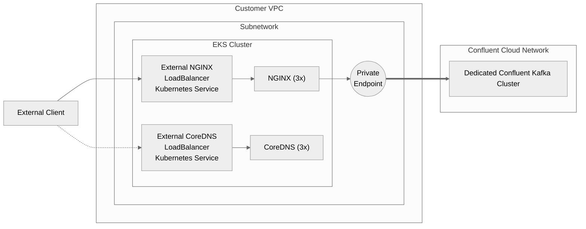
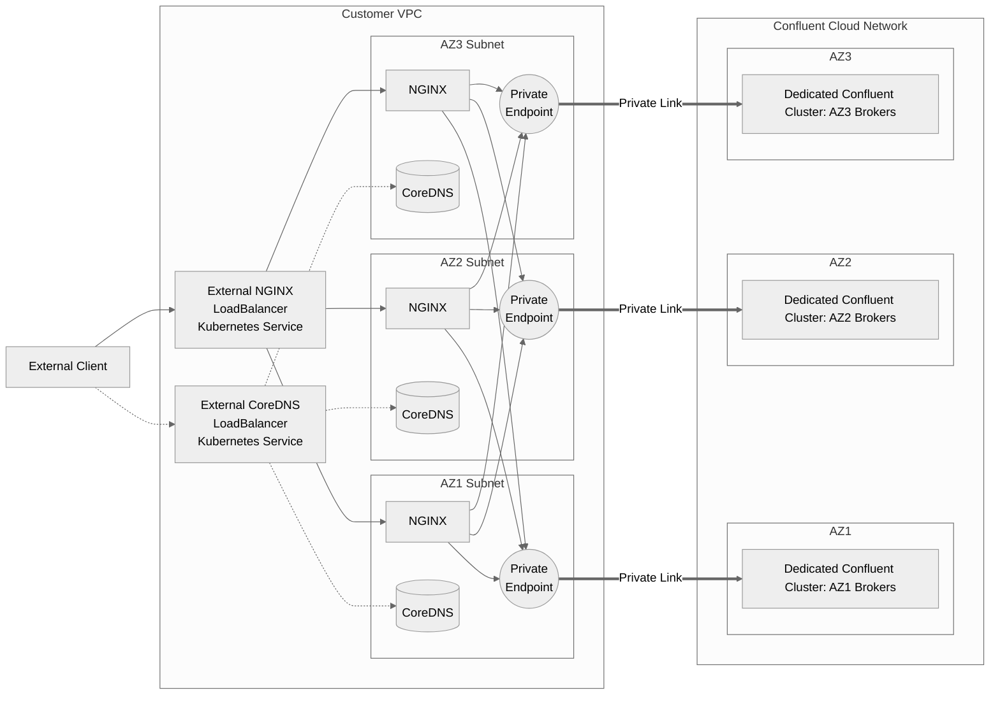
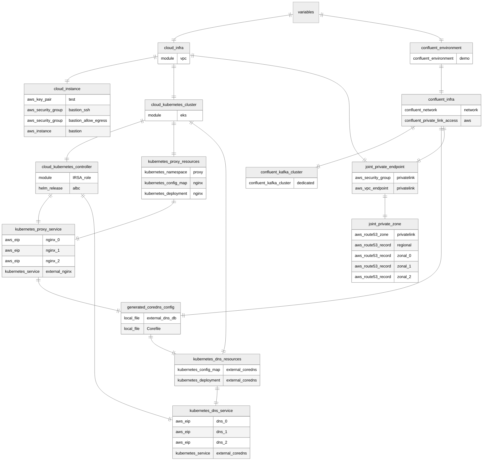

# Expose Confluent Cloud AWS PrivateLink Clusters

This is an example of how to expose a Confluent Cloud AWS PrivateLink cluster to clients outside of AWS

## Simplified Diagram

## Complete (Zonal) Diagram
This is more acurate

# Resources

`cloud_infra.tf`: No Dependencies
* VPC (module). Consists of:
    * Internet Gateway
    * 3x Subnets
    * Route Table pointing subnets at IGW

`cloud_instance.tf`: depends on `cloud_infra.tf`: bastion host
* VM for bastion host

`cloud_kubernetes_cluster.tf`: depends on `cloud_infra.tf`: EKS cluster
* EKS cluster (module). Includes the following (among others):
    * EKS Cluster
    * Security Groups (necessary for AWS Load Balancer Controller to work)
    * 3x BottleRocket worker nodes

`cloud_kubernetes_controller.tf`: depends on `cloud_kubernetes_cluster.tf`: Runs the AWS Load Balancer Controller
* IRSA role (module)
* ALBC Kubernetes Service Account (in `kube-system` namespace)
* ALBC Helm release

`confluent_environment.tf`: No Dependencies
* Confluent environment

`confluent_infra.tf`: depends on `confluent_environment.tf`
* Confluent Cloud Network (CCN) configured for PrivateLink in the provided zones
* PrivateLink Access granting the customer AWS account access to the network

`confluent_kafka_cluster.tf`: depends on `confluent_infra.tf`
* Dedicated, Single-Zone PSC cluster in the CCN

`joint_private_endpoint.tf`: depends on `cloud_infra.tf` and `confluent_infra.tf`:
* Security Group for Private Endpoint
* Private Endpoint (one PE consists of multiple 'endpoints')

`joint_private_zone.tf`: depends on `joint_private_endpoint.tf`
* R53 Private Zone
* R53 Regional CNAME record
* 3x R53 Zonal CNAME records

`kubernetes_proxy_resources.tf`: runs on EKS (`cloud_kubernetes_cluster`)
* Namespace for proxy layer
* ConfigMap for NGINX
* Deployment for NGINX

`kubernetes_proxy_service.tf`: runs on EKS, depends on `kubernetes_proxy_resources` and AWS LBC (`cloud_kubernetes_controller`)
* 3x Elastic IPs (for load balancer)
* External LoadBalancer Service for NGINX

`generated_coredns_config.tf`: depends on `confluent_infra.tf`
* Corefile (for CoreDNS)
* Generated zone file (for CoreDNS)

`kubernetes_dns_resources.tf`: runs on EKS (`cloud_kubernetes_cluster`), depends on `generated_coredns_config`
* ConfigMap for CoreDNS
* Deployment for CoreDNS

`kubernetes_dns_service.tf`: runs on EKS, depends on `kubernetes_dns_resources` and AWS LBC (`cloud_kubernetes_controller`)
* 3x Elastic IPs (for load balancer)
* External LoadBalancer Service for CoreDNS

## Resource Map

