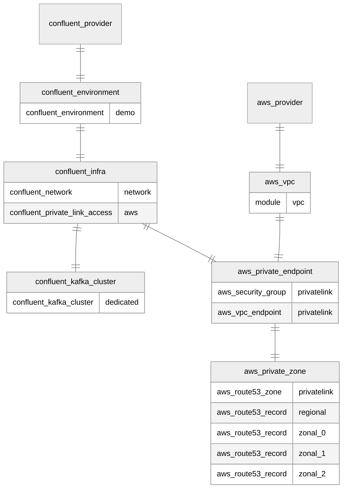

# Confluent Cloud AWS PrivateLink Clusters

This is an example of how provision an AWS VPC and a Confluent PrivateLink cluster connected to the VPC.

If you're looking for the example including CoreDNS, this was moved [here](../aws-privatelink-coredns)

# Resources

`aws_vpc.tf`: No Dependencies
* VPC (module). Consists of:
    * Internet Gateway
    * 3x (Public) Subnets
    * Route Table pointing subnets at IGW

`confluent_environment.tf`: No Dependencies
* Confluent environment (logical Confluent construct that isolates Confluent resources from each other)

`confluent_infra.tf`: depends on `confluent_environment.tf`
* Confluent Cloud Network (CCN) configured for PrivateLink in the provided zones (corresponds to an AWS VPC on the Confluent side, with the network stack required to host a PrivateLink service)
* PrivateLink Access granting the customer AWS account access to the network (exposes the PrivateLink VPC Endpoint to your AWS account))

`confluent_kafka_cluster.tf`: depends on `confluent_infra.tf`
* Dedicated, Single-Zone PrivateLink cluster in the CCN

`joint_private_endpoint.tf`: depends on `aws_vpc.tf` and `confluent_infra.tf`:
* Security Group for Private Endpoint
* Private Endpoint (one PE consists of a set of three 'endpoints', which land in three subnets in your VPC)

`joint_private_zone.tf`: depends on `joint_private_endpoint.tf`
* R53 Private Zone
* R53 Regional CNAME record - one record for the entire region, points at all three endpoints
* 3x R53 Zonal CNAME records - one record per AZ, pointing at the zonal endpoint

## Resource Map

