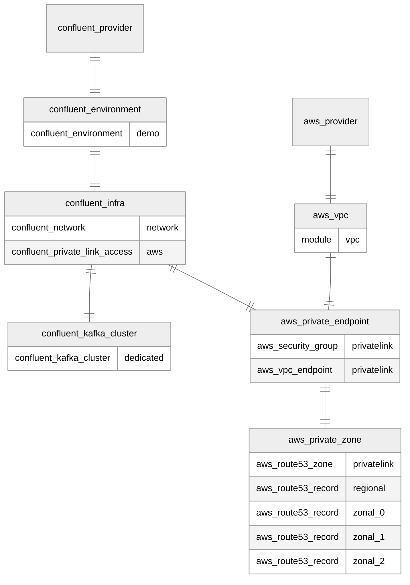

# Confluent Cloud AWS PrivateLink Clusters

This is an example of how to expose a Confluent Cloud AWS PrivateLink cluster to clients outside of AWS

# Resources

`aws_vpc.tf`: No Dependencies
* VPC (module). Consists of:
    * Internet Gateway
    * 3x Subnets
    * Route Table pointing subnets at IGW

`confluent_environment.tf`: No Dependencies
* Confluent environment

`confluent_infra.tf`: depends on `confluent_environment.tf`
* Confluent Cloud Network (CCN) configured for PrivateLink in the provided zones
* PrivateLink Access granting the customer AWS account access to the network

`confluent_kafka_cluster.tf`: depends on `confluent_infra.tf`
* Dedicated, Single-Zone PSC cluster in the CCN

`joint_private_endpoint.tf`: depends on `aws_vpc.tf` and `confluent_infra.tf`:
* Security Group for Private Endpoint
* Private Endpoint (one PE consists of multiple 'endpoints')

`joint_private_zone.tf`: depends on `joint_private_endpoint.tf`
* R53 Private Zone
* R53 Regional CNAME record
* 3x R53 Zonal CNAME records

## Resource Map

