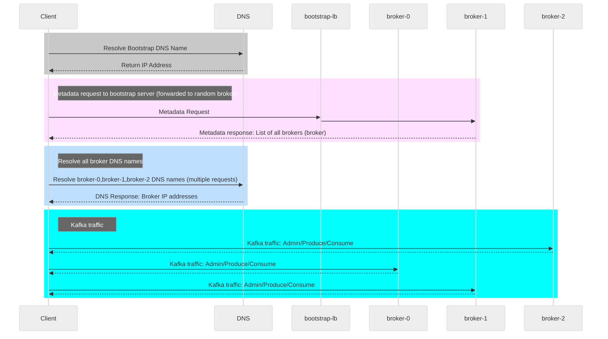
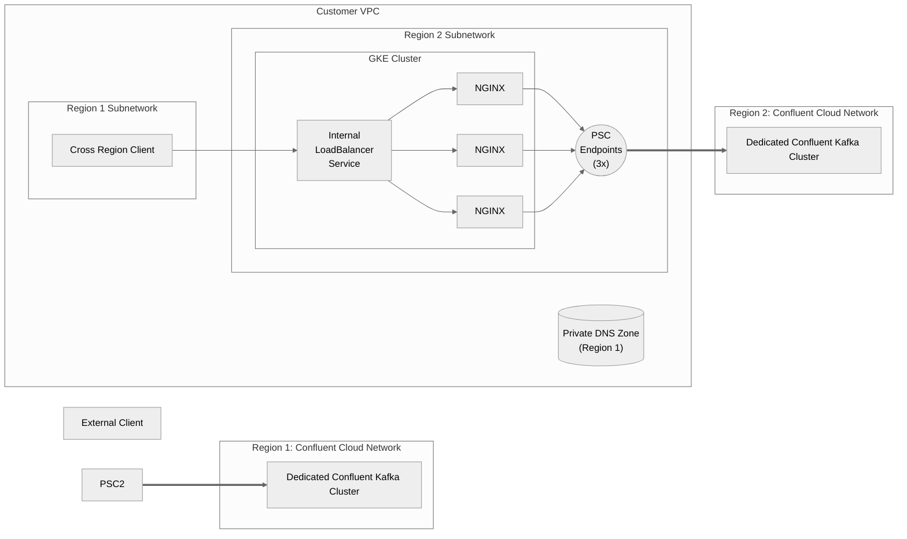
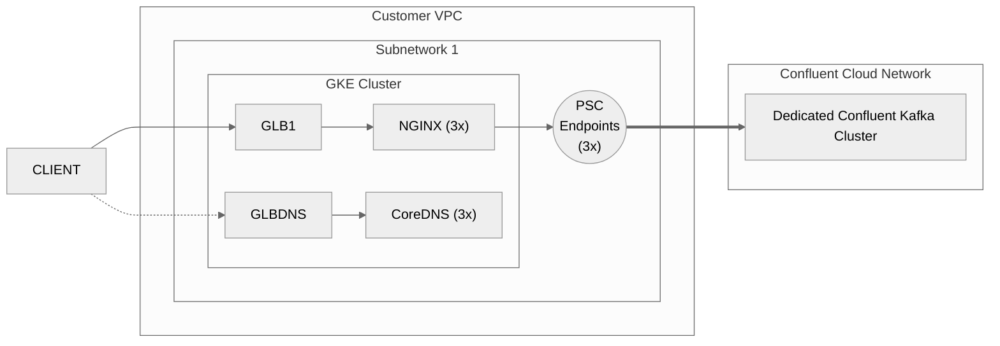
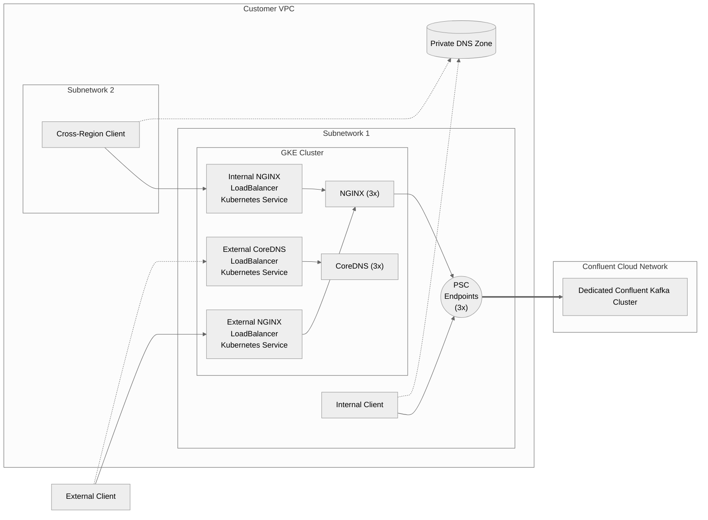

```mermaid
%%{init: {"theme": "neutral", "logLevel": 1}}%%
sequenceDiagram
    participant client as Client
    participant dns as DNS
    participant bs as bootstrap-lb
    participant b0 as broker-0
    participant b1 as broker-1
    participant b2 as broker-2

    rect rgb(200,200,200)
    client->>dns: Resolve Bootstrap DNS Name
    dns-->>client: Return IP Address
    end

    rect rgb(255, 223, 255)
    Note right of client: Metadata request to bootstrap server (forwarded to random broker)
    client->>bs: Metadata Request
    bs->>b1: 
    b1-->>client: Metadata response: List of all brokers (broker)
    end


    rect rgb(191, 223, 255)
    Note right of client: Resolve all broker DNS names
    client->>dns: Resolve broker-0,broker-1,broker-2 DNS names (multiple requests)
    dns-->>client: DNS Response: Broker IP addresses
    end

    rect rgb(0,255,255)
    Note right of client: Kafka traffic
    client->>b2: Kafka traffic: Admin/Produce/Consume
    b2-->>client: 
    client->>b0: Kafka traffic: Admin/Produce/Consume
    b0-->>client: 
    client->>b1: Kafka traffic: Admin/Produce/Consume
    b1-->>client: 
    end
```

```mermaid
%%{init: {"theme": "neutral", "logLevel": 1, "flowchart": {"rankSpacing": 40}}}%%
flowchart LR
    K1[Dedicated Confluent Kafka Cluster]
    K2[Dedicated Confluent Kafka Cluster]
    PSC1(("PSC\nEndpoints\n(3x)"))
    NGINX1A[NGINX]
    NGINX1B[NGINX]
    NGINX1C[NGINX]
    GLB1[Internal\nLoadBalancer\nService]

    CLIENT["External Client"]

    DNS1[("Private DNS Zone\n(Region 1)")]

        subgraph CCN2[Region 2: Confluent Cloud Network]
            K1
        end
        subgraph CCN1[Region 1: Confluent Cloud Network]
            K2
        end

    classDef padding fill:none,stroke:none

    subgraph vpc[Customer VPC]
      subgraph pad1[ ]
        subgraph SN1[Region 2 Subnetwork]
            subgraph pad2[ ]
              subgraph GKE1[GKE Cluster]
                GLB1
                NGINX1A
                NGINX1B
                NGINX1C
              end
              PSC1
            end
        end
        subgraph SN2[Region 1 Subnetwork]
          subgraph pad3[ ]
            ICLIENT[Cross Region Client]
          end
        end
      end

      ICLIENT-->GLB1
      
      DNS1
    end

    class pad1,pad2,pad3 padding


    GLB1 --> NGINX1A & NGINX1B & NGINX1C --> PSC1

    PSC1 ==> K1
    PSC2 ==> K2

```

```mermaid
%%{init: {"theme": "neutral", "logLevel": 1, "flowchart": {"rankSpacing": 40}}}%%
flowchart LR
    K1[Dedicated Confluent Kafka Cluster]
    PSC1(("PSC\nEndpoints\n(3x)"))
    NGINX["NGINX (3x)"]
    DNS["CoreDNS (3x)"]


    subgraph CCN[Confluent Cloud Network]
        K1
    end

    classDef padding fill:none,stroke:none

    subgraph vpc[Customer VPC]
      subgraph pad1[ ]
        subgraph SN1[Subnetwork 1]
            subgraph pad2[ ]
              subgraph GKE1[GKE Cluster]
                GLB1
                NGINX
                GLBDNS
                DNS
              end
              PSC1
            end
        end
      end
    end

    class pad1,pad2,pad3 padding
    
    GLBDNS --> DNS

    GLB1 --> NGINX --> PSC1

    PSC1 ==> K1

    CLIENT -.-> GLBDNS
    CLIENT --> GLB1
```

```mermaid
%%{init: {"theme": "neutral", "logLevel": 1, "flowchart": {"rankSpacing": 40}}}%%
flowchart LR
    K1[Dedicated Confluent Kafka Cluster]
    PSC1(("PSC\nEndpoints\n(3x)"))
    NGINX["NGINX (3x)"]
    GLB1["External NGINX\nLoadBalancer\nKubernetes Service"]
    GLB2["Internal NGINX\nLoadBalancer\nKubernetes Service"]
    GLBDNS["External CoreDNS\nLoadBalancer\nKubernetes Service"]
    DNS["CoreDNS (3x)"]

    DNS1[("Private DNS Zone")]

    CLIENT["External Client"]

    subgraph CCN[Confluent Cloud Network]
        K1
    end

    classDef padding fill:none,stroke:none

    subgraph vpc[Customer VPC]
      subgraph pad1[ ]
        direction RL
        subgraph SN1[Subnetwork 1]
            subgraph pad2[ ]

              CLIENT1[Internal Client]
              subgraph GKE1[GKE Cluster]
                GLB1
                GLB2
                NGINX
                GLBDNS
                DNS
              end
              PSC1
            end
        end
        subgraph SN2[Subnetwork 2]
            subgraph pad3[ ]
              ICLIENT[Cross-Region Client]
            end
        end
      end

      DNS1
    end

    class pad1,pad2,pad3 padding
    
    GLBDNS --> DNS

    GLB1 --> NGINX --> PSC1
    GLB2 --> NGINX

    PSC1 ==> K1

    CLIENT -.-> GLBDNS
    CLIENT --> GLB1

    CLIENT1 -.-> DNS1
    CLIENT1 -->PSC1

    ICLIENT -.-> DNS1
    ICLIENT -->GLB2
```