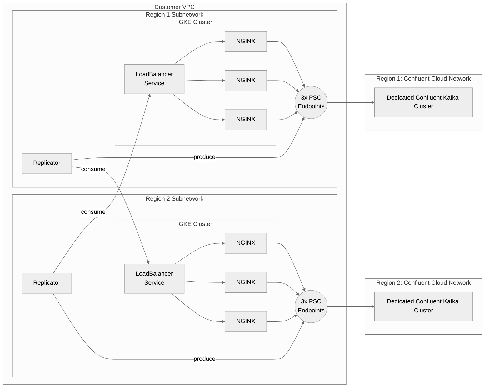

# Confluent Cloud in GCP, with PSC



This project has two levels of Terraform:
* One to automate the creation of 'infrastructure' (potentially, these would be things managed by the customer's existing automation)
* One to automate the creation of Confluent-specific infrastructure, on a per-region basis

Note: GCP is different from AWS and Azure, in these significant ways:
* GCP PSC endpoints cannot be accessed from other regions
* GCP VCPs ('networks') are global, and then have a 'subnetwork' for each region.

## Infra terraform (top-level directory)
Infrastructure repo (top-level terraform) creates infrastructure that everything in this depends on.

It uses these variables:
`variables.tf`: Variables (see terraform.tfvars for reference config)
* Must specify Google Project
* Must indicate what regions you want to run this in, with information (CIDR and zones) you want for each region)

This terraform will consist of these resources:

`cloud_network.tf`: No dependencies
* VPC ('customer owned' global network)
* Subnetwork for each region

`cloud_instance.tf`: (optional) depends on cloud_network.tf:
* (Ubuntu) Bastion host in each subnet (could be used for Replicator, can also be used for testing)
* Firewall allowing SSH into the bastion host

`confluent_infra.tf`: No dependencies
* Confluent 'environment' for provisioning Confluent resources in it (assumes you already have a Confluent org)

`tfvars.regional.tf`: Depends on everything else
* For each region, will generate a tfvars file for the region-specific Terraform (at `region_<regionname>/terraform.tfvars`)

# Region terraform
Create a copy of the `/region` terraform directory for _each_ region you want to do this for (at `region_<regionname>`). Each region terraform will create the following resources:

`_parent_data.tf`: No resources, only data reads

`confluent_infra.tf`: depends on parent only
* Confluent Cloud Network (CCN) configured for PSC in the relevant zones
* PSC Access (PrivateLink Access) granting the project access to the network

`confluent_kafka_cluster.tf`: depends on `confluent_infra.tf`
* Dedicated, Single-Zone PSC cluster in the CCN

`gcp_gke_cluster.tf`: depends on parent only
* GKE cluster (in-region)

`gcp_private_endpoint.tf`: depends on `confluent_infra.tf`
* 3x private static IP, one for each AZ
* 3x private endpoint forwarding rule, pointing the static IP at the PSC endpoint

`gcp_proxy_ip.tf`: depends on parent only
* (Optional) static private IP for proxy LB
* (Optional) static public IP for proxy LB

_Private and public can be toggled individually; assumption is that you have at least one_

`gcp_private_zone.tf`: depends on `confluent_infra.tf`, `gcp_private_endpoint.tf`
* Private DNS Zone
* 1x record set for top-level wildcard
    * For local region, three private static IPs (PSC private endpoints)
    * For all other regions, one private (or public) static IP (pointing at the internal or external proxy LB)
* 1x record set for *each* zonal wildcard, each with 1 entry
    * For local region, one private static IPs (PSC private endpoint)
    * For all other regions, one private (or public) static IP (pointing at the internal or external proxy LB)

`kubernetes_proxy_resources.tf`: depends on `gcp_gke_cluster.tf` and `gcp_proxy_ip.tf`
* Namespace for proxy layer
* ConfigMap for NGINX
* Deployment for NGINX
* (Optional) Internal LoadBalancer Service for NGINX
* (Optional) External LoadBalancer Service for NGINX
## Example usage

In the top-level directory:

```bash

gcp-psc % export CONFLUENT_CLOUD_API_KEY=xyz123
gcp-psc % export CONFLUENT_CLOUD_API_SECRET=abcdef

gcp-psc % terraform init

...
... Output omitted
...

gcp-psc % terraform apply

Terraform used the selected providers to generate the following execution plan. Resource actions are indicated with the following symbols:
  + create

Terraform will perform the following actions:

...
... Output omitted
...

Do you want to perform these actions?
  Terraform will perform the actions described above.
  Only 'yes' will be accepted to approve.

  Enter a value: yes

confluent_environment.demo: Creating...

...
... Output omitted
...

Apply complete! Resources: 9 added, 0 changed, 0 destroyed.

Outputs:

confluent_environment_id = "env-6k9yjj"
environment_name = "justinlee-psc"
google_compute_network_name = "justinlee-psc"
google_project = "sales-engineering-206314"
owner = "justinlee"
zz_jump_box = {
  "justinlee-psc-us-east1" = "35.196.145.50"
  "justinlee-psc-us-east4" = "34.86.2.33"
}
zz_next_steps = {
  "us-east1" = <<-EOT
  
  cp -rpv region_template/* _region_us-east1
  cd _region_us-east1
  terraform init
  terraform apply
  EOT
  "us-east4" = <<-EOT
  
  cp -rpv region_template/* _region_us-east4
  cd _region_us-east4
  terraform init
  terraform apply
  EOT
}
```

See created directories:

```
gcp-psc % ls -alh
total 240
drwxr-xr-x  23 jlee  staff   736B Oct 24 11:31 .
drwxr-xr-x   3 jlee  staff    96B Oct 20 10:38 ..
drwxr-xr-x   3 jlee  staff    96B Oct 24 11:19 _region_us-east1
drwxr-xr-x   3 jlee  staff    96B Oct 24 11:19 _region_us-east4
...
drwxr-xr-x  14 jlee  staff   448B Oct 24 10:54 region_template
...
```

See generated tfvars:

```
gcp-psc % ls _region_*
_region_us-east1:
terraform.tfvars

_region_us-east4:
terraform.tfvars
```

To create a child region, copy the `region_template` template directory to the generated region directory:

```bash
gcp-psc % cp -rpv region_template/* _region_us-east1
region_template/_parent_data.tf -> _region_us-east1/_parent_data.tf
region_template/confluent_infra.tf -> _region_us-east1/confluent_infra.tf
region_template/confluent_kafka_cluster.tf -> _region_us-east1/confluent_kafka_cluster.tf
region_template/confluent_private_endpoint.tf -> _region_us-east1/confluent_private_endpoint.tf
region_template/confluent_private_zone.tf -> _region_us-east1/confluent_private_zone.tf
region_template/confluent_proxy.tf -> _region_us-east1/confluent_proxy.tf
region_template/confluent_proxy_resources.tf -> _region_us-east1/confluent_proxy_resources.tf
region_template/output.tf -> _region_us-east1/output.tf
region_template/providers.tf -> _region_us-east1/providers.tf
region_template/readme.md -> _region_us-east1/readme.md
region_template/sample.tfvars -> _region_us-east1/sample.tfvars
region_template/variables.tf -> _region_us-east1/variables.tf
```

Then cd into the generated directory, init, and run:

```
gcp-psc % cd _region_us-east1

_region_us-east1 % terraform init
...
... Output omitted
...

_region_us-east1 % terraform apply

Terraform used the selected providers to generate the following execution plan. Resource actions are indicated with the following symbols:
  + create
 <= read (data resources)

...
... Output omitted
...

Plan: 20 to add, 0 to change, 0 to destroy.

Changes to Outputs:
  + internal_proxy_endpoint = (known after apply)

Do you want to perform these actions?
  Terraform will perform the actions described above.
  Only 'yes' will be accepted to approve.

  Enter a value: yes

...
... Output omitted
...


Apply complete! Resources: 20 added, 0 changed, 0 destroyed.

Outputs:

internal_proxy_endpoint = "10.161.0.11"
kafka_endpoint = "lkc-rrpj8p-pll2ep.us-east1.gcp.glb.confluent.cloud:9092"
```