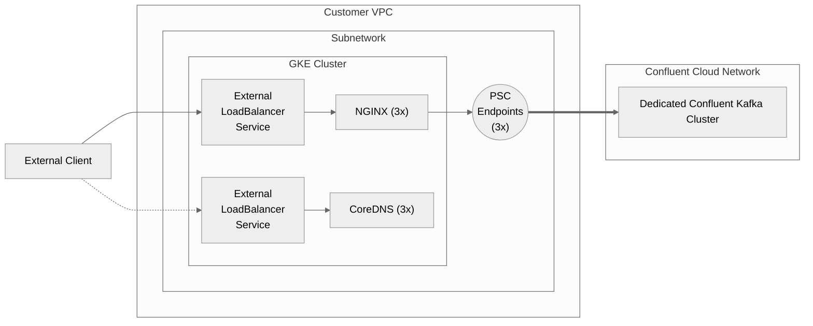
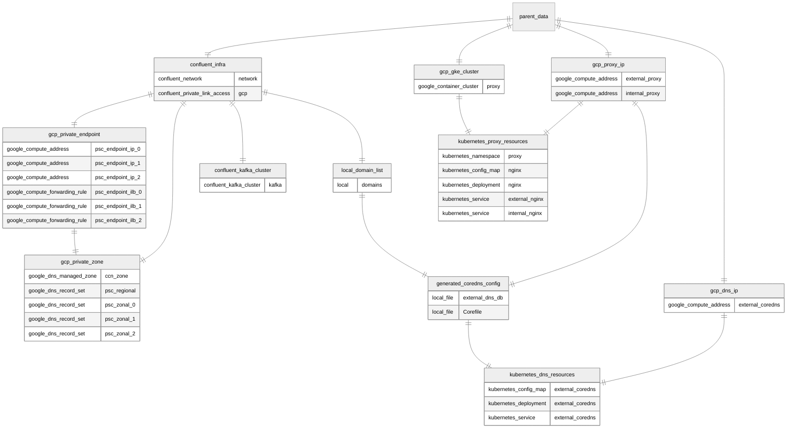

# Region terraform (Child directory)
Create a copy of the `/region` terraform directory for _each_ region you want to do this for (at `region_<regionname>`). Each region terraform will create the following resources:

`_parent_data.tf`: No resources, only data reads

`confluent_infra.tf`: depends on parent only
* Confluent Cloud Network (CCN) configured for PSC in the relevant zones
* PSC Access (PrivateLink Access) granting the project access to the network

`confluent_kafka_cluster.tf`: depends on `confluent_infra.tf`
* Dedicated, Single-Zone PSC cluster in the CCN

`gcp_gke_cluster.tf`: depends on parent only
* GKE cluster (in-region)

`gcp_private_endpoint.tf`: depends on `confluent_infra.tf`
* 3x private static IP, one for each AZ
* 3x private endpoint forwarding rule, pointing the static IP at the PSC endpoint

`gcp_proxy_ip.tf`: depends on parent only
* (Optional) static private IP for proxy LB
* (Optional) static public IP for proxy LB

_Private and public can be toggled individually; assumption is that you have at least one_

`gcp_private_zone.tf`: depends on `confluent_infra.tf`, `gcp_private_endpoint.tf`
* Private DNS Zone
* 1x record set for top-level wildcard
    * For local region, three private static IPs (PSC private endpoints)
    * For all other regions, one private (or public) static IP (pointing at the internal or external proxy LB)
* 1x record set for *each* zonal wildcard, each with 1 entry
    * For local region, one private static IPs (PSC private endpoint)
    * For all other regions, one private (or public) static IP (pointing at the internal or external proxy LB)

`kubernetes_proxy_resources.tf`: depends on `gcp_gke_cluster.tf` and `gcp_proxy_ip.tf`
* Namespace for proxy layer
* ConfigMap for NGINX
* Deployment for NGINX
* (Optional) Internal LoadBalancer Service for NGINX
* (Optional) External LoadBalancer Service for NGINX

---

## External PSC Proxies

## Resource Map

